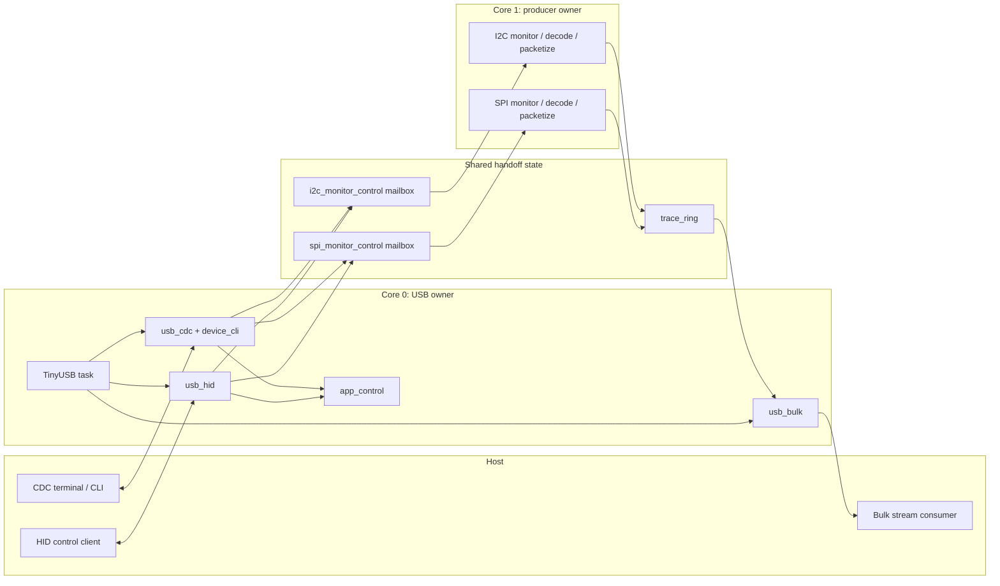
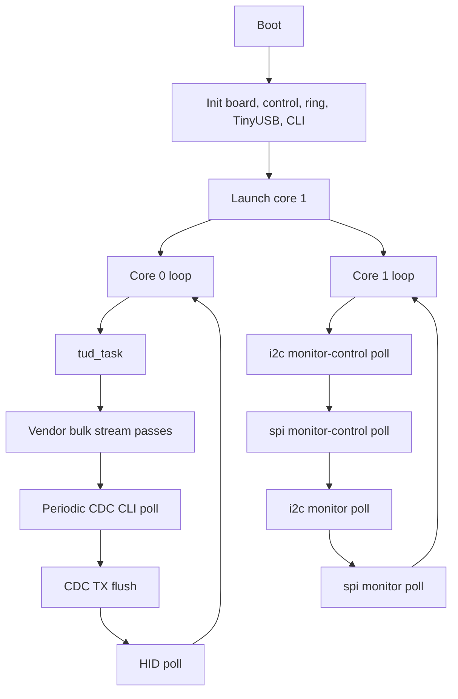
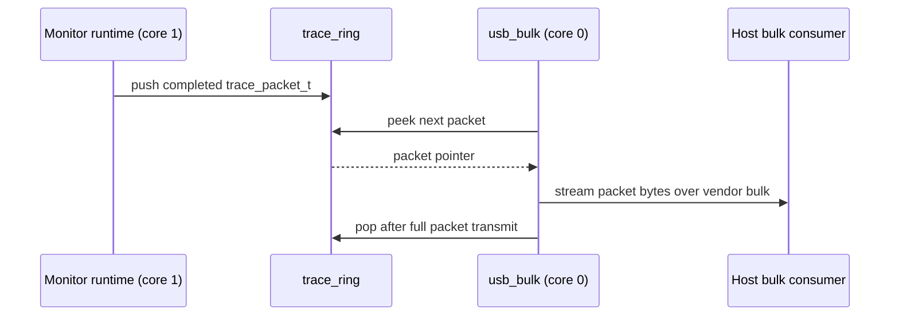
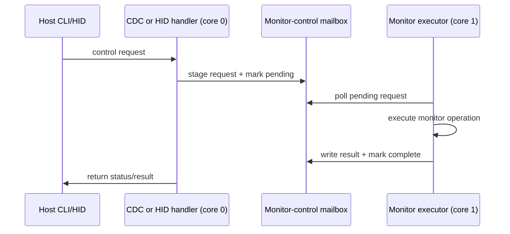

# Firmware Architecture

## Purpose

This document describes the high-level firmware architecture of PicoTrace.

It explains how the major components fit together, which responsibilities belong to each core, and
how the lower-level detail-design modules interact during normal operation.

This document complements the notes in `docs/details/` rather than replacing them.

## Architectural Goals

The current firmware architecture is shaped by a small set of practical goals:

- keep USB ownership simple and deterministic
- keep trace capture and USB service decoupled through explicit buffers and control bridges
- support both SPI and I2C under the same host-visible control model
- preserve packet boundaries from producer-side assembly through host streaming
- keep control traffic bounded so it does not dominate the streaming path

## Top-Level Structure

At a high level, the firmware is divided into five cooperating areas:

- application control state
- protocol capture and decode
- trace packet assembly and ring buffering
- USB transport and host control
- board and system support

## Core Ownership Split

The firmware uses a deliberate two-core ownership model.

### Core 0

Core 0 owns:

- TinyUSB device service through `tud_task()`
- CDC receive and transmit service
- the board-local CLI shell
- HID command dispatch and response staging
- vendor bulk trace streaming
- shared application-control toggles such as stream enable

This keeps all USB interaction on one core, which avoids splitting endpoint ownership across cores
that still share one TinyUSB device stack.

### Core 1

Core 1 owns:

- capture-side monitor initialization
- producer-side monitor control executors
- I2C monitor runtime polling
- SPI monitor runtime polling
- producer-side SPI packetization into the shared trace ring

This keeps sampling, monitor state, and protocol-specific producer behavior away from the USB owner.

## Main Runtime Loops

The two cores cooperate through simple foreground loops.

This service order is intentional:

- USB is serviced only on core 0
- the stream path gets multiple service opportunities per outer loop
- control traffic is serviced periodically rather than continuously
- producer-side work stays on core 1

## Component Roles

### Application Control

`app_control` holds small shared user-visible toggles such as stream enable and LED state.

This module is intentionally small. It is a policy switchboard, not a transport or capture layer.

### Capture And Decode

The capture side is protocol-specific.

For I2C, the current architecture already includes:

- sampling
- decode
- packet assembly
- handoff into the shared trace ring

For SPI, the current architecture now also includes:

- clocked sampling
- transaction attribution by observed `CS_N`
- one DMA-backed raw sampler per observed SPI bus with software MOSI/MISO extraction
- packet assembly
- handoff into the shared trace ring

The current SPI transaction attribution still samples `CS_N` ownership at DMA half-buffer handoff
rather than on every raw SPI bit. That is an intentional simplification for the common case where
controllers leave a visible idle gap around `CS_N` transitions. If future hardware needs exact
ownership across back-to-back `CS_N` changes without a usable gap, the upgrade path is to carry
`CS_N` history in the raw capture stream and decode those transitions in software.

Both protocols now feed the same shared packet and USB streaming model.

### Trace Ring

`trace_ring` is the ownership boundary between producer-side packet creation and USB-side packet
delivery.

The ring preserves fixed packet slots and explicit packet boundaries. It is not treated as a byte
stream.

### USB Transport

The USB transport area exposes three host-visible functions:

- CDC for interactive CLI command and text response traffic
- HID for structured bounded command and status exchanges
- vendor bulk for trace streaming from firmware to host

That design is described in more detail in `docs/details/usb-multi-interface-design.md`.

## End-To-End Data Flow

### Trace Data Path

The normal trace path is:

1. a protocol monitor captures protocol-side activity on core 1
2. producer logic assembles one or more `trace_packet_t` fragments
3. completed fragments are pushed into `trace_ring`
4. core 0 bulk streaming code peeks packets from the ring
5. vendor bulk writes packet bytes to the host while preserving packet boundaries

### Control Path

The control path is transport-agnostic above the transport boundary.

Both CDC CLI and HID eventually drive the same producer-side monitor-control executors.

## Relationship To Detail Design Notes

The architecture relies on the detail notes as component-level references:

- `i2c-pio-sampler-design.md`: I2C sampling and decode-side behavior
- `spi-pio-monitor-design.md`: SPI monitor intent, bus ownership, and packetization rules
- `trace-ring-buffer-design.md`: ring behavior and packet-slot ownership
- `usb-multi-interface-design.md`: composite USB function split and USB service policy

The architecture-level rule is that those components must compose through explicit interfaces rather
than hidden cross-dependencies.

## Interface Design Principles

The current architecture follows a few simple interface rules:

- transport modules own transport details and do not perform protocol decode
- capture modules own sampling and protocol-specific producer state
- the trace ring is the producer-to-consumer packet boundary
- control bridges hide cross-core command execution behind mailbox interfaces
- application control exposes only small shared policy toggles

These rules keep the system understandable even though it is multicore and multi-interface.

## Architectural Constraints

The current architecture intentionally accepts these limits:

- one TinyUSB owner core
- one shared SPSC trace ring
- bounded CDC and HID control traffic
- no protocol-specific extra USB transport
- no bypass path around the shared packet/ring model

Those limits are acceptable because they keep the system deterministic and small while the product
is still centered on passive SPI and I2C tracing.