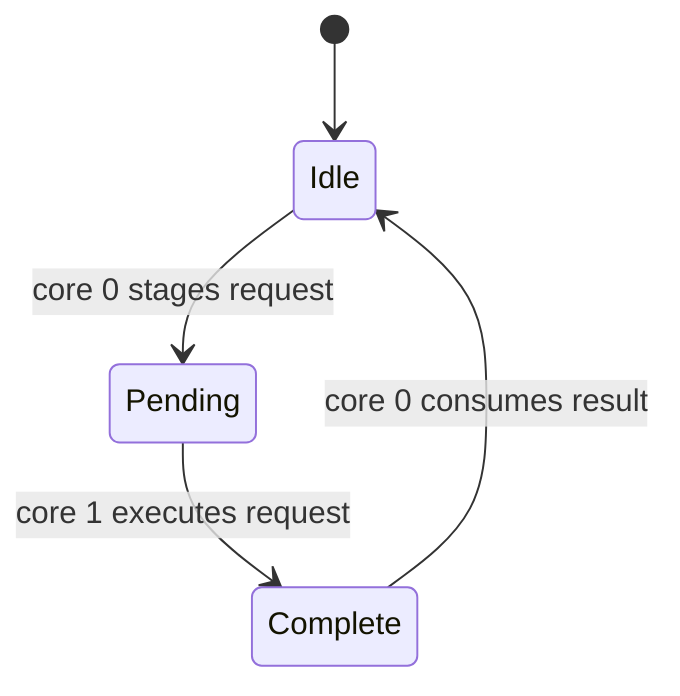
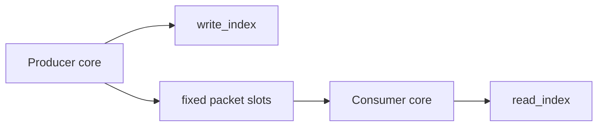

# Interface And Synchronization Design

## Purpose

This document describes the interface boundaries, synchronization mechanisms, and race-condition
avoidance strategy used by the current PicoTrace firmware architecture.

The goal is not to eliminate concurrency entirely. The goal is to make concurrency explicit,
bounded, and easy to reason about.

## Main Concurrency Boundaries

There are three important synchronization boundaries in the current design:

- core 0 to core 1 monitor control requests
- core 1 producer to core 0 USB consumer packet handoff
- USB-class service sharing on core 0

The design avoids uncontrolled shared mutable state by using one specific mechanism for each
boundary instead of letting modules reach directly across cores.

## Interface Inventory

### Monitor-Control Interfaces

The monitor-control bridge modules are:

- `i2c_monitor_control.*`
- `spi_monitor_control.*`

These modules expose synchronous-looking APIs to the caller on core 0, but execute the actual
monitor operation on core 1.

That keeps producer-owned state owned by the producer core.

### Trace Handoff Interface

The producer-to-consumer handoff interface is `trace_ring.*`.

Capture-side code does not write directly into USB endpoint functions, and USB-side code does not
mutate capture-side protocol state.

### USB-Class Interfaces

The USB transport modules are:

- `usb_cdc.*`
- `usb_hid.*`
- `usb_bulk.*`

All of them are serviced only from core 0.

That is an architectural synchronization decision, not just an implementation detail.

## Cross-Core Monitor Control Mechanism

The monitor-control bridges use a shared mailbox pattern.

Each mailbox has:

- a staged command kind
- command arguments
- a result field
- reply storage for status snapshots when needed
- a small lifecycle state machine

The lifecycle is:

- idle
- pending
- complete

### Why This Works

This avoids direct concurrent mutation of producer-owned monitor state.

Core 0 does not reconfigure monitors directly.

Instead:

- core 0 stages a request
- core 1 polls and executes the request
- core 0 waits for completion

This is simple, blocking, and adequate for bounded control operations.

### Memory Ordering

The mailbox state transitions use acquire/release semantics.

That means:

- staged request fields are visible before the state becomes `pending`
- staged reply fields are visible before the state becomes `complete`

This is the minimum needed to avoid stale reads across cores without introducing a larger locking
framework.

## Trace Ring Synchronization Mechanism

The trace ring is a singleton single-producer single-consumer queue.

The intended ownership model is:

- producer-side capture logic pushes packets
- consumer-side USB stream logic peeks and pops packets

The ring uses monotonic read and write indices with acquire/release atomic operations.

### Why SPSC Matters

The ring stays small and predictable because it is not a general multi-producer queue.

That removes several race classes entirely:

- producer-producer slot collisions
- consumer-consumer pop collisions
- lock convoying on a shared queue mutex

The architecture depends on preserving that SPSC assumption unless there is a very strong reason to
change it.

## USB-Side Synchronization Mechanism

USB classes are synchronized primarily through ownership, not through locks.

Core 0 alone owns:

- `tud_task()`
- CDC callbacks and queue draining
- HID command dispatch and response publication
- vendor bulk stream progress

This removes entire categories of races that would otherwise appear if multiple cores tried to
service TinyUSB endpoints or shared USB state concurrently.

## Race Conditions Avoided By Design

### Monitor Reconfiguration Versus Producer Runtime

Without the mailbox model, control code on core 0 could try to change monitor state while core 1 is
sampling or packaging data.

The architecture avoids that by executing reconfiguration on core 1 itself.

### Producer Versus Consumer Packet Ownership

Without the trace ring, producer code and USB code would need to coordinate ownership of live packet
buffers directly.

The architecture avoids that by:

- writing complete packet fragments into the ring
- letting USB borrow only the current queued packet
- popping the packet only after transmission completes

### USB-Class Reentrancy Across Cores

Without single-core USB ownership, CDC, HID, and bulk code could race through TinyUSB shared state.

The architecture avoids that by never splitting USB class service across cores.

## Remaining Race Risks And Current Mitigations

The architecture does not make races impossible. It makes them narrow and visible.

### Shared Policy Toggles

Small shared flags such as stream enable are simple and low frequency, but they still cross logical
ownership boundaries.

Current mitigation:

- keep the shared state minimal
- use simple boolean policy gates rather than large shared mutable structures

### Partial Stream State During Disable

The vendor stream path may be in the middle of a packet when streaming is disabled.

Current mitigation:

- reset the local borrowed-packet stream state when streaming is disabled
- restart from a packet boundary when streaming is re-enabled

This favors deterministic restart behavior over preserving a partially transmitted packet.

### Bounded Queue Overflow

CDC and the trace ring can both fill.

Current mitigation:

- CDC write requests fail when local queue space is unavailable
- the trace ring drops newly produced packets when full and tracks drop counters

This prevents deadlock and keeps the firmware moving even when data is lost.

## Interface Design Rules

The current architecture relies on a few interface rules to keep synchronization manageable:

- producer-owned protocol state is mutated only by the producer owner
- cross-core control goes through mailbox bridges only
- trace data crosses from producer to consumer only through `trace_ring`
- USB transport modules do not own protocol-decode state
- higher-level modules should observe counters and status snapshots instead of reaching into private state

If a future design violates one of these rules, it should justify the new concurrency model
explicitly rather than silently bypassing the existing boundaries.

## Recommended Future Direction

If throughput or feature pressure grows, the safest path is still incremental:

- keep one USB owner core
- keep explicit producer-to-consumer packet handoff
- extend mailbox commands instead of adding hidden cross-core state mutation
- preserve fixed packet boundaries
- avoid introducing multi-producer queue semantics unless required by a concrete design change

That path keeps synchronization costs comprehensible while allowing the capture runtime to become
more capable.